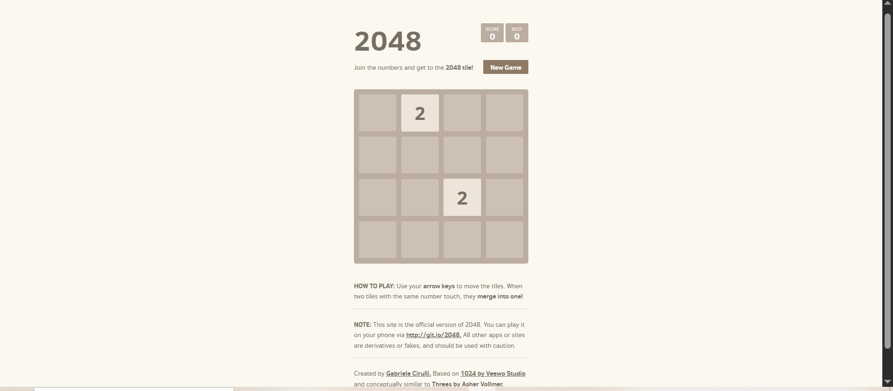
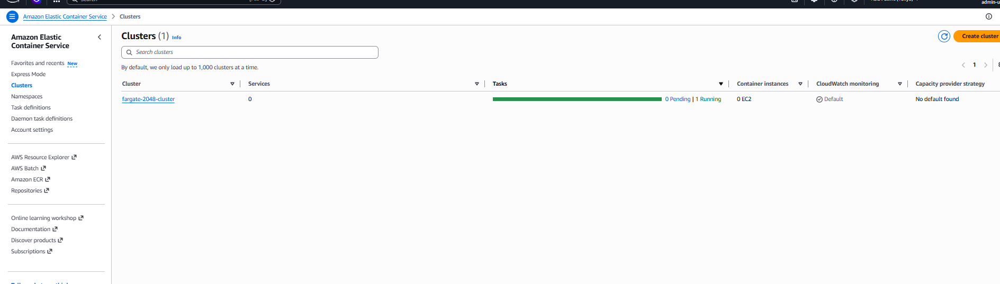
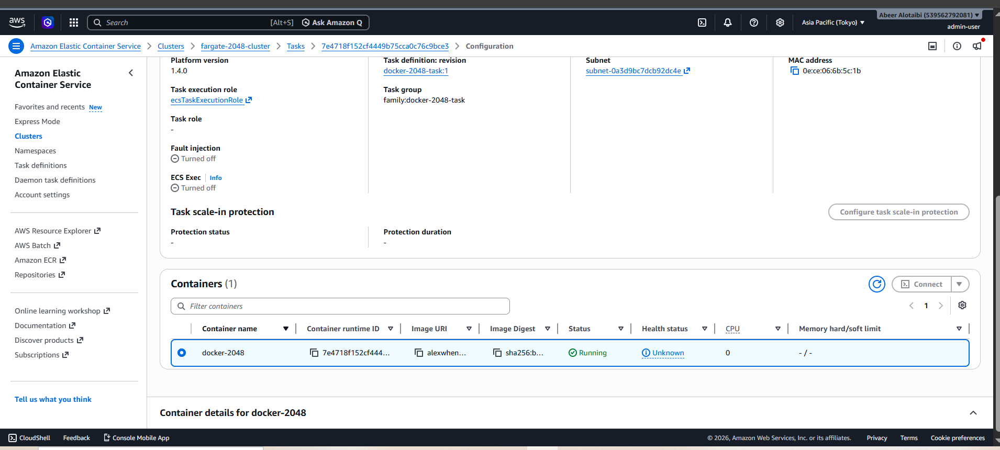
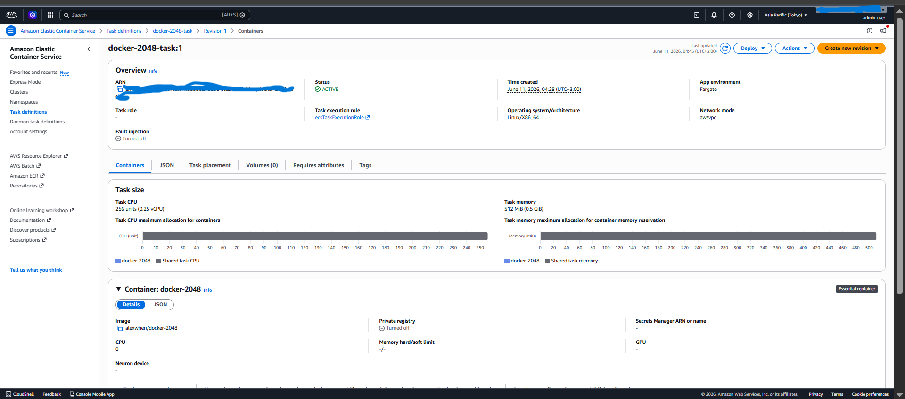
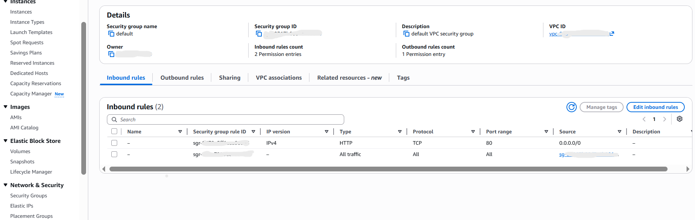

# AWS ECS Fargate 2048 Game Deployment

This project demonstrates how to deploy a containerized web application on AWS using Amazon ECS Fargate.
A public Docker image for the 2048 game was pulled directly from Docker Hub and deployed as a serverless container without managing EC2 instances.

## Project Overview

The goal of this project is to practice deploying containers on AWS using ECS Fargate and configuring the required networking and security settings to make the application accessible through a public endpoint.

## Architecture

```text
Docker Hub Image
      ↓
Amazon ECS Task Definition
      ↓
AWS Fargate Task
      ↓
Default VPC + Public Subnet
      ↓
Security Group allowing HTTP traffic on port 80
      ↓
Public IP Address
      ↓
2048 Web Application
```

## AWS Services Used

* Amazon ECS
* AWS Fargate
* Docker Hub
* VPC
* Subnets
* Security Groups
* IAM Task Execution Role
* Public IP Networking

## Deployment Steps

1. Created an ECS cluster using AWS Fargate.
2. Created a Task Definition for the 2048 container.
3. Used the Docker Hub image:

```text
alexwhen/docker-2048
```

4. Configured container port mapping on port 80.
5. Selected a default VPC and public subnets.
6. Enabled public IP assignment for the Fargate task.
7. Updated the Security Group to allow inbound HTTP traffic on port 80.
8. Ran the ECS task and verified that the application was accessible from the browser.

## Screenshots

### Application Running in Browser


### ECS Cluster


### Running Fargate Task


### Task Definition


### Security Group Inbound Rule


## What I Learned

* How to run containers on AWS without managing EC2 instances.
* How ECS Task Definitions work.
* How Fargate runs containers in a serverless way.
* How to configure VPC networking for containerized applications.
* How Security Groups control inbound access to applications.
* How to expose a containerized web application using a public IP.

## Cost Control

The task was run temporarily for testing and validation, then stopped to avoid unnecessary charges.
A budget alert was also configured in AWS Billing to monitor any unexpected usage.

## Project Status

Completed successfully.
